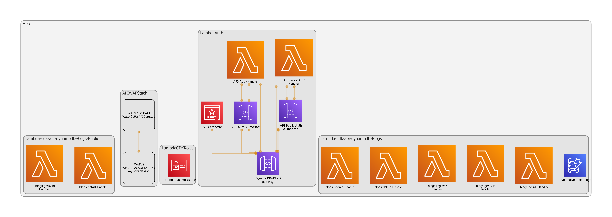

# CDK Project for Deploying Serverless Databases (DynamoDB) with an API layer

Cloud Development Kit project for managing AWS Services for deploying Serverless Databases and API Layer

## Architecture

## Pre-requisites

- An AWS Account, with an IAM with required permissions to use CDK
- A registered Domain, managed by Route 53
- Locally stored AWS Credentials which grant programmatic access, created in AWS IAM

## Steps to deploy

- After downloading the repo, run the command `npm i` to install the node_modules folder and libraries
- In the terminal, run `npm run watch` to watch and compile changes
- Update lib/services.ts file to customise the db schema, api methods and the domain you wish to host the endpoints
- Run `cdk bootstrap` to bootstrap your AWS account
- Run `cdk deploy` to deploy all the resources
- During deployment the owner of your custom domain will need to approve the SSL certificate request, which will have been sent to them via email
- After deployment, your custom domain provider will need to include a new A record pointing to your newly provisioned API Gateway domain name. Found here: https://eu-west-2.console.aws.amazon.com/apigateway/main/publish/domain-names?region=eu-west-2 (change region if outside eu-west-2)
- Once completed you will be able to make API calls to your new endpoints. You can check the progress of the deployment in AWS CloudFormation or test the new endpoints via Postman or in AWS API Gateway

Note: It may take up approximately 15 minutes for your changes to your custom domain to be made in the Global DNS records. You can successfully test your API endpoints and Authorizers in the API Gateway web console as soon as the deployment has finished

## Useful commands

- `npm run build` compile typescript to js
- `npm run watch` watch for changes and compile
- `npm run test` perform the jest unit tests
- `cdk deploy` deploy this stack to your default AWS account/region
- `cdk diff` compare deployed stack with current state
- `cdk synth` emits the synthesized CloudFormation template

### Generate a CDK-DIA diagram PNG:

`npx cdk-dia`

### Common Issues

#### Multiple locally stored AWS credentials

If you have multiple locally stored AWS credentials, or if you are not sure that you have a key stored with progammatic access, you should check your local machine:

- Linux and macOS: `~/.aws/config` or `~/.aws/credentials`
- Windows: `%USERPROFILE%\.aws\config` or `%USERPROFILE%\.aws\credentials`

To select a non-default account, run the cdk commands with the profile flag on the end like so `cdk bootstrap --profile myprofilename`
